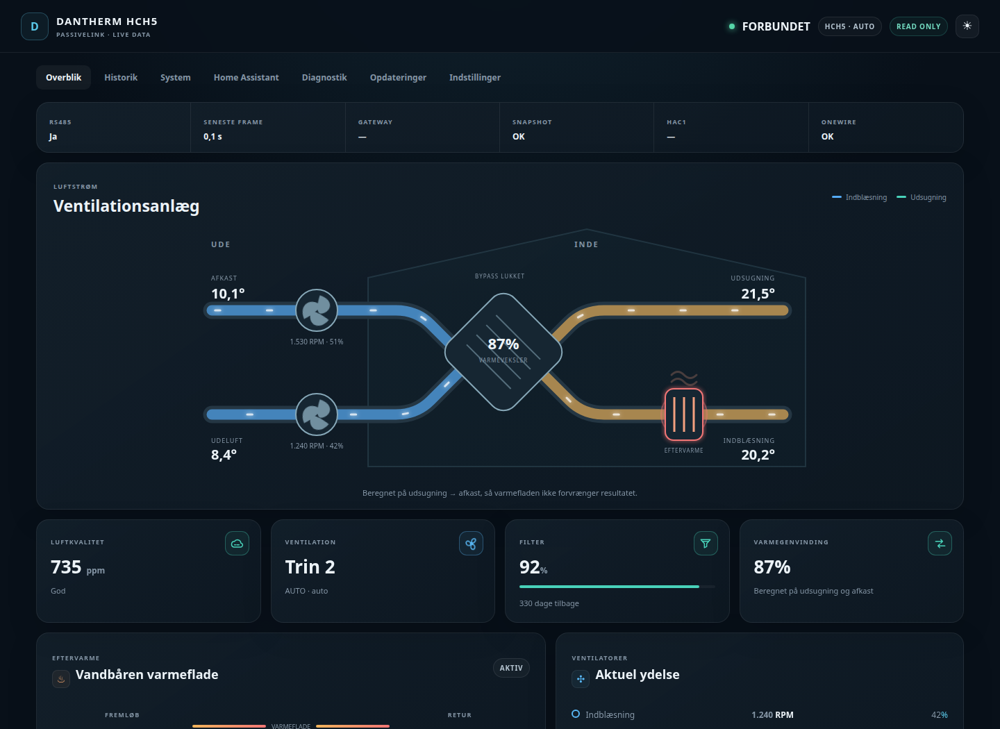
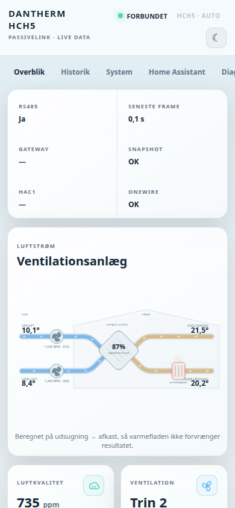
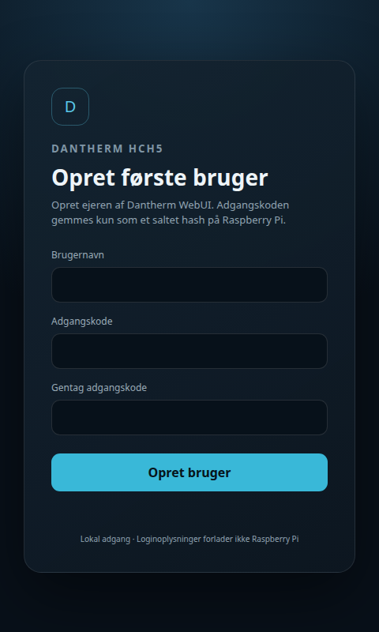
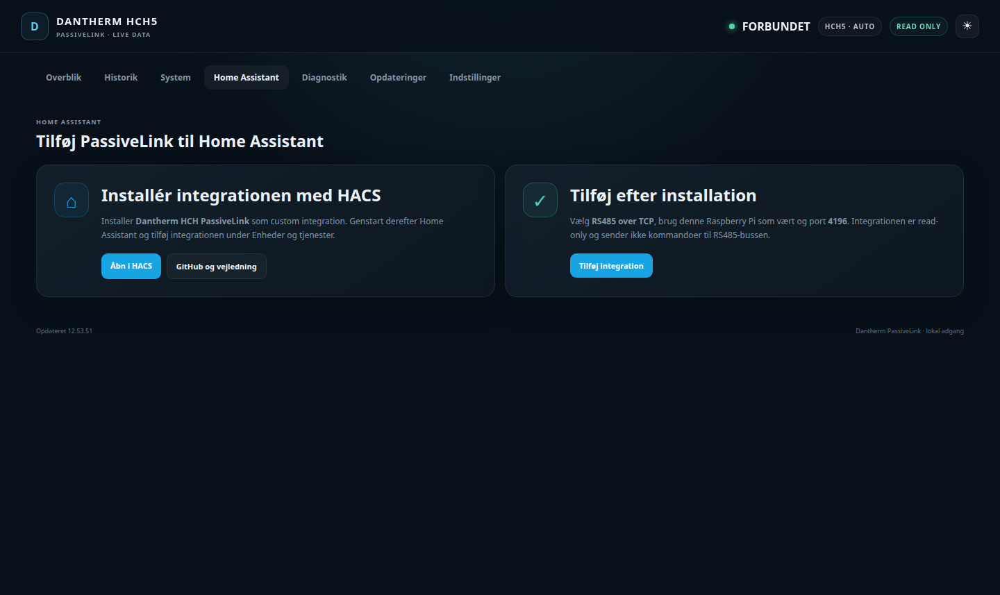

# Dantherm HCH PassiveLink WebUI

A modern, responsive local WebUI and fail-safe Raspberry Pi controller for a Dantherm HCH5 MK1/HAC1. The Pi automatically takes over only when HCP4 is quiet and the RS485 bus is healthy; any verified foreign write makes it yield immediately.

> This is an unofficial community project and is not developed, approved or supported by Dantherm Group.



## Highlights

- physically meaningful normal and bypass airflow diagrams;
- live heat-recovery, after-heater, fan, filter and air-quality states;
- desktop, tablet and mobile layouts with persistent light/dark themes;
- 30-day bounded SQLite history;
- Raspberry Pi, service, OneWire and network diagnostics;
- first-run owner setup, salted PBKDF2 password hashes, server-side sessions, CSRF protection and login rate limiting;
- owner-controlled username/password changes and an explicit security warning before login can be disabled;
- allowlisted Raspberry Pi reboot, shutdown, service restart and CPU power profiles;
- one-click, single-file debug report with current state, seven days of bounded service/system logs and Raspberry Pi health data;
- direct HACS, GitHub and Home Assistant config-flow links for the companion integration.
- Local Auto and Smart Auto with six validated fan profiles, leased Home Assistant room inputs and automatic local fallback;
- HCP4-priority master arbitration with a 10-second quiet takeover and a transaction-local 0.2-second echo window;
- machine API for Home Assistant intent and sensor data—Home Assistant never writes Modbus directly.

<p>
  
  
</p>



## Companion Home Assistant integration

Install [MRDonnii/dantherm-hch-passivelink](https://github.com/MRDonnii/dantherm-hch-passivelink) through HACS, then select **RS485 over TCP** and point it at the PassiveLink gateway, normally port `4196`.

For the controller beta, install integration tag `v0.8.0-beta.1` as a specific HACS version. Its Options UI reads and writes controller settings through the authenticated Pi API, manages dynamic Smart Auto rooms and keeps the Pi as source of truth.

[](https://my.home-assistant.io/redirect/hacs_repository/?owner=MRDonnii&repository=dantherm-hch-passivelink&category=integration)

## Install everything on Raspberry Pi OS / Ubuntu / Debian

Find the adapter under `/dev/serial/by-id/`, then run:

```bash
curl -fsSL https://raw.githubusercontent.com/MRDonnii/dantherm-hch-passivelink-webui/main/install.sh \
  | sudo bash -s -- --device /dev/serial/by-id/usb-YOUR_ADAPTER
```

Add `--enable-onewire` for optional DS18B20 sensors and host diagnostics.

To install the controller beta explicitly (prereleases are not returned by GitHub's `releases/latest` endpoint):

```bash
curl -fsSL https://raw.githubusercontent.com/MRDonnii/dantherm-hch-passivelink-webui/test/hcp4-replacement-controller/install.sh \
  | sudo bash -s -- --beta --device /dev/serial/by-id/usb-YOUR_ADAPTER
```

- [Komplet dansk installations- og RS485-guide](docs/installation.da.md)
- The installer supports Raspberry Pi OS, Debian 12 and Ubuntu 22.04/24.04.
- It installs the controller-aware gateway, raw TCP mirror for Home Assistant, WebUI, login, systemd services and the allowlisted admin helper. Existing tokens, controller state, login data and YAML settings are backed up and preserved.

## Embedding in an existing gateway

`gateway/dashboard_server.py` is embedded in the gateway process so both components use the same in-memory state without opening another RS485 reader:

```python
from dashboard_server import DashboardHttpServer

dashboard = DashboardHttpServer(
    "0.0.0.0",
    8080,
    gateway_state,
    "Dantherm HCH5",
    "http://127.0.0.1:4197/temperatures",
)
dashboard.start()
```

Copy `gateway/dashboard_server.py`, `gateway/webui_auth.py` and `gateway/webui/` beside the gateway application. The gateway service user must be able to write `/var/lib/dantherm-hch5-ha/` for history and authentication state.

The optional privileged helper `gateway/dantherm_pi_admin_api.py` must run as a separately sandboxed root systemd service. It accepts only a fixed action/service/profile allowlist and requires a bearer token. Pass that same token to the unprivileged dashboard process as `DANTHERM_REBOOT_TOKEN`. The helper and dashboard default to loopback port `4198`; override `DANTHERM_ADMIN_BIND`, `DANTHERM_ADMIN_PORT` and `DANTHERM_ADMIN_URL` only when required. Never expose an unrestricted shell or place the token in browser-side code.

Reference files are provided in [`systemd/`](systemd/). Generate a unique token, install `admin.env.example` as root-owned `/etc/dantherm-webui/admin.env` with mode `0600`, and give the dashboard service the same token through its own root-owned environment file.

## Security model

- Browser and Home Assistant endpoints submit high-level intent only. The hardware boundary permits controller writes exclusively while arbitration reports `PI_MASTER`; HCP4 and unknown/unhealthy states block them.
- Bypass remains read-only because no verified write sequence exists in the repository evidence.
- First use is locked until the owner creates an account.
- Passwords are stored as salted PBKDF2-SHA256 hashes, never plaintext.
- Sessions are server-side and cookies are `HttpOnly` and `SameSite=Strict`.
- State-changing browser requests require a CSRF token.
- Login can be disabled only with the current password and an explicit risk acknowledgement.
- Network settings remain read-only on netboot installations until their real network stack and rollback path are verified.
- Debug reports are plain-text, bounded in size and redact known password, token, cookie and authorization patterns. Review a report before sharing it because logs can still contain installation-specific details such as hostnames, addresses and sensor IDs.

The WebUI is designed for a trusted local network. Put it behind HTTPS or a trusted reverse proxy before exposing it beyond the LAN.

## Development and tests

```bash
python3 -m unittest discover -s tests -v
node --check gateway/webui/dashboard.js
node --check gateway/webui/auth.js
python3 -m py_compile gateway/*.py
```

## License

MIT — see [LICENSE](LICENSE).
